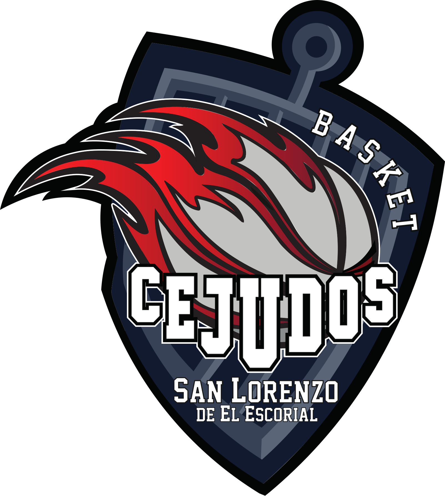
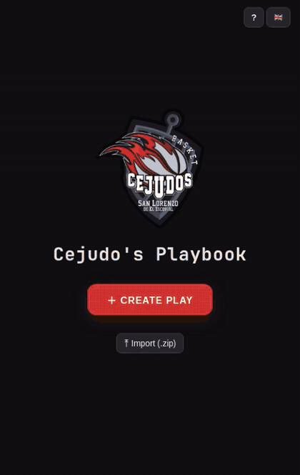

<p align="center">
  
</p>

<h1 align="center">Cejudo's Playbook</h1>

<p align="center">
  Design basketball plays step by step, animate them, and share them with your team.<br>
  Live at <a href="https://cejudos.com">cejudos.com</a> — built for <strong>Cejudos San Lorenzo de El Escorial</strong>.
</p>

---

## Demo

Creating a play in three steps — placing the players, drawing screens, cuts and passes, then watching the whole play animate:

<p align="center">
  
</p>

## Features

- **Step-based editor** on an SVG half court — place the five players (and the ball) anywhere for step 1, draw what happens, commit it as a step, repeat.
- **Three actions**: movement arrows (curvable), screens (rotatable perpendicular bar) and passes (straight, dashed, snapping to the receiver — or to the *end* of the receiver's cut).
- **Real ball logic** — the ball always belongs to a player, travels with the dribbler, and the ownership chain across steps stays consistent automatically. Screeners can't receive; the carrier can't screen.
- **Smart playback** — video-player controls with per-action pacing: passes, cuts and screen-assisted cuts play out in order, so a busy step lasts longer than a simple one.
- **Share by link** — any play becomes a URL: view-only by default (with an *Edit* hand-off button), or editable directly. No server involved; the play is compressed into the link itself.
- **Export** — animated GIF, video (MP4/WebM) or a printable PDF with one 2×2 grid of steps per page.
- **Backup** — export all plays as a `.zip` and import them on another device (imported plays get a badge, never overwrite anything).
- **Organized home screen** — search, pagination, drag-to-reorder, multi-select with per-page select-all, and bulk delete.
- **8 languages** — English, Spanish, Italian, Russian, Chinese, Serbian, Slovenian and Greek, via the flag selector.
- **Works offline** — a service worker caches the whole app (exports included); installable on a phone as a standalone app.
- **Interactive tour** — a skippable guided walkthrough on first visit, restartable any time from the **?** help menu.

## How to use

1. **Home screen** — lists your saved plays: tap one to open it, drag the dots to reorder, use the checkboxes for bulk delete, or hit **＋ Create play**.
2. **New play** — five players (1–5) and the ball start out of bounds above the baseline.
3. **Select tool (1)** — drag players (and the ball) to their initial positions (step 1 only; after that, players move exclusively via drawn arrows). Out-of-bounds placement is allowed.
4. **Arrow tool (2)** — drag from a player to where they cut. **Screen tool (3)** — same, but the arrow ends in the classic perpendicular screen bar (rotate it with the gold handle). Drag the ball to hand it to someone, or drag an arrow *from* the ball to throw a pass — it snaps to the receiving teammate, or to the end of their cut if they're moving.
5. **Curve an arrow** — drag the round handle in the middle of an arrow; drag the square handle to change the destination. **Eraser (4)** — click an arrow or its player to remove it.
6. **Two actions, one player** — when the carrier both passes and moves, the lighter line happens second; double-click (or long-press) a line to make it go first.
7. **Next step ＋** — commits the drawn arrows: the next step starts where the arrows end. Steps without actions (and the last one) can be deleted from their bin bubble. **↺ Reset all** clears every step after a confirmation.
8. **Playback** — play/pause (Space), prev/next step (←/→), scrub the timeline, change speed. Players follow their drawn paths, curves included; arrows on the last step play immediately without committing.
9. **Rename** — click the play's name in the top bar and type.
10. **Undo / redo** — ↶ ↷ in the toolbar, or Ctrl/Cmd+Z and Ctrl/Cmd+Shift+Z (or Ctrl+Y). Covers drags, arrows, curves, erases, steps, resets and renames.

Keyboard: **1–4** select tools, **Esc** back to select, **Space** play/pause, **←/→** change step, **Ctrl+Z / Ctrl+Shift+Z / Ctrl+Y** undo & redo.

Plays are saved automatically in your browser (localStorage) — nothing ever leaves your device unless you share or export it.

## Run it locally

```sh
python3 -m http.server 8000
```

Then open http://localhost:8000

No dependencies, no build step — plain HTML/CSS/JS. `gif.js` / `gif.worker.js` are a vendored copy of [gif.js](https://github.com/jnordberg/gif.js) (MIT) for GIF encoding, loaded on demand at export time; everything else is dependency-free.

## Deployment

Pushing to `main` deploys automatically to GitHub Pages under the custom domain [cejudos.com](https://cejudos.com). The service worker uses a network-first strategy, so online visitors always get the latest deploy while offline visitors get the last version they saw.
